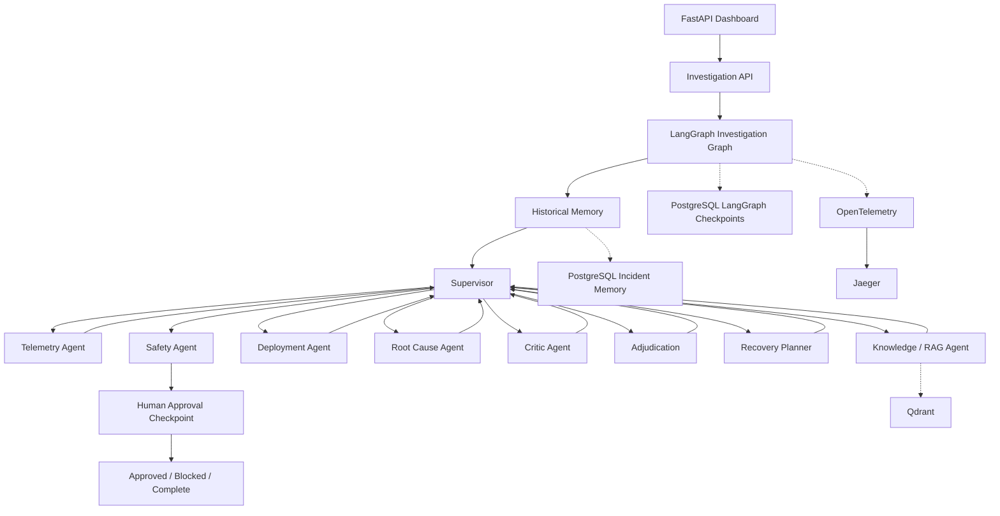

# SentinelOps Architecture

## System overview

SentinelOps treats incident investigation as a coordinated graph of specialized agents rather than a single LLM call.



## Investigation lifecycle

### 1. Historical context

The historical memory component retrieves prior incident context that may be relevant to the current incident.

This gives downstream agents additional context without making historical similarity the sole basis for a root-cause decision.

### 2. Supervisor planning

The supervisor determines which specialized investigation task should run next and coordinates the graph.

The supervisor does not perform every investigation function itself. It delegates to purpose-specific agents.

### 3. Evidence collection

The telemetry, knowledge, and deployment agents contribute different evidence categories:

- telemetry: metrics, traces, logs, operational signals;
- knowledge: documentation and retrieved knowledge;
- deployment: changes, releases, and deployment context.

Evidence is normalized into a shared state representation.

### 4. Root-cause reasoning

The root-cause agent generates competing hypotheses.

Each hypothesis can contain:

- supporting evidence;
- contradicting evidence;
- causal evidence;
- causal relationships;
- confidence;
- status.

The implementation uses explicit causal requirements and hypothesis-specific trigger/mechanism signals rather than simply counting evidence items.

### 5. Critique and adjudication

The critic challenges the candidate explanations.

The adjudication layer then considers factors such as:

- temporal support;
- causal support;
- recovery support;
- alternative evidence gaps;
- confidence.

This creates a separate decision stage between hypothesis generation and recovery planning.

### 6. Recovery planning

The recovery planner converts the adjudicated hypothesis into structured steps.

Each step records:

- action;
- purpose;
- risk;
- approval requirement;
- supporting evidence.

Recovery steps are proposals only.

### 7. Safety and human approval

The safety agent evaluates the recovery plan and determines whether human approval is required.

When required, LangGraph pauses at the human checkpoint. PostgreSQL-backed checkpointing allows the investigation state to survive an API process restart.

The human decision is explicitly recorded as approved or blocked.

## Memory layers

SentinelOps has two distinct persistence responsibilities.

### Incident memory

Completed incident information can be persisted for historical retrieval and future investigations.

### LangGraph checkpoint memory

LangGraph checkpoints preserve graph execution state, including interrupted human-approval investigations.

These are intentionally separate concerns: historical semantic memory answers "what happened before?", while checkpoints answer "where did this investigation stop?".

## Retrieval-Augmented Generation

The RAG path is conceptually:

```text
Documents / incident knowledge
          │
          ▼
       Chunking
          │
          ▼
      Embeddings
          │
          ▼
        Qdrant
          │
          ▼
      Retrieval
          │
          ▼
      Agent context
```

The retrieval layer is used as evidence/context for investigation agents rather than as an autonomous decision maker.

## Observability

Every wrapped investigation graph node records a structured execution event.

The event contains:

```text
trace_id
incident_id
node
status
timestamp
duration_ms
output_keys
error (when applicable)
```

OpenTelemetry spans can be exported locally through the included collector configuration to Jaeger. The API also exposes the structured events to the dashboard, where they appear as the Agent Execution Timeline.

## Safety boundary

The architecture deliberately separates:

```text
Investigation
     │
     ▼
Recovery proposal
     │
     ▼
Safety review
     │
     ▼
Human approval
     │
     └──► no automatic production execution
```

This makes the project suitable for demonstrating agent planning and coordination without giving the portfolio application direct authority over production infrastructure.

## Evaluation architecture

The deterministic benchmark provides:

- 15 incident scenarios;
- expected hypothesis IDs;
- required evidence concepts;
- expected recovery concepts;
- per-incident and aggregate metrics.

The benchmark evaluates the reasoning pipeline locally and does not require production telemetry.

## Design principles

1. **Specialization over monolithic agents** — each investigation responsibility is explicit.
2. **Evidence before action** — recovery planning follows investigation and adjudication.
3. **Competing explanations** — the system keeps alternatives visible.
4. **Human control** — impactful recovery requires explicit approval.
5. **Durable state** — interrupted investigations can resume.
6. **Observable execution** — agent/node activity is recorded.
7. **Deterministic evaluation** — benchmark behavior is reproducible.
8. **Cost-conscious development** — local infrastructure is preferred where practical.
